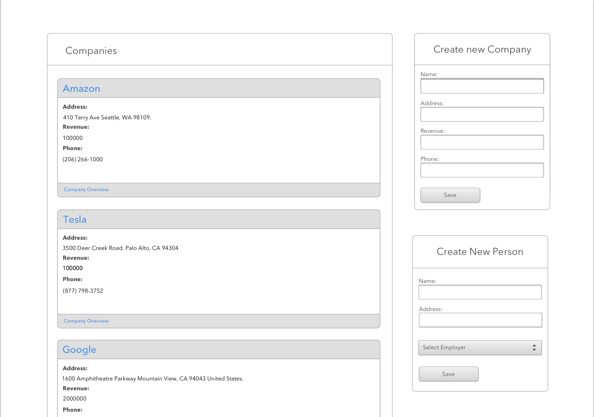
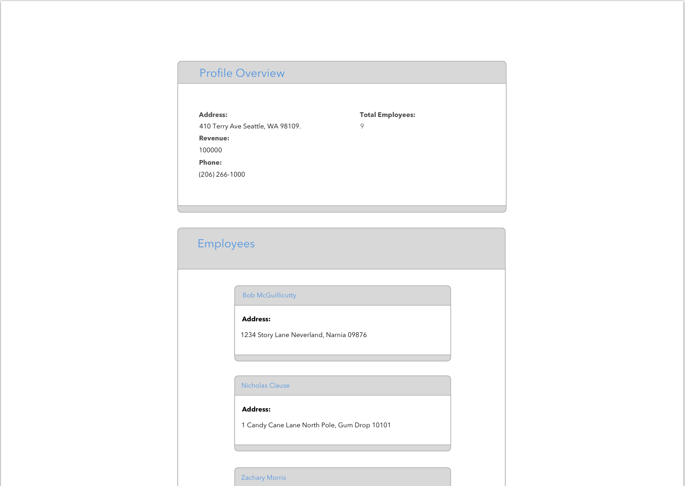

# Lean Frontend Coding Challenge

This challenge was created to test your ability to code in a React environment with Redux as the state manager.

> If you have any questions regarding the assignment, the scope we're grading or the dynamic of the challenge, please contact me **[oscar@leantech.me](oscar@leantech.me)**

## Table of Contents

- [Getting Started](#getting-started)
- [Motivations](#challenge-motivations)
- [Objectives](#challenge-objectives)
- [Extras](#extra-objectives)
- [Color Palette](#color-palette)
- [Grading Criteria](#grading-criteeria)

## Getting Started

- `yarn` to get your dependencies (you'll have to have yarn installed).
- `yarn start` to fire up your webpack environment for viewing in your browser of choice.

## Challenge Motivations

- Show the ability to create components in JSX that follow a design mockup.
- Show proficiency in creating **reusable** components in React.
- Use React best practices in managing information.
- Use Redux to manage state at the application level.
- Use a CSS preprocessor (LESS is installed by default, however SASS or SCSS can be used)
- Use good judgement in deciding types of components (container, presentational, HOC)

## Challenge Objectives

- The Numbers Page and bean counter widget were built solely as an example in architecting the directory structure and it's child files.
  You can choose to keep it or remove it.

- Create the widgets you see in the image below in the HomePage component.

- The widget titled _Create New Company_ should have the behavior of adding new companies to the widget entitled _Companies_
- The widget titled _Create New Person_ should add employees to a company's list of employees. If no companies are entered, this widget should be disabled or not visible, your choice.
- The widget title _Companies_ should present all of the companies that have been entered, each with their own card.
- The company cards should provide the data entered from the _Create New Company_ widget, and also have a link to the DetailsPage.
  The Details page will then display the respective companies information on click/key press.
- If no companies have been entered, a message saying: _There are currently no companies to review._ should be provided to the user.
- Validation should be provided in the following manner: **No fields should be empty or have falsy values**

  

- Create the widgets you see in the image below in the DetailsPage component.

- The widget entitled _Profile Overview_ should display a company's information entered from the Home page in addition to the number of employees entered in the HomePage _Create New Person_ widget.

- The widget entitled _Employees_ should display the employees that are affiliated with the company that was chosen from the drop down on the _Create New Person_ widget from the Home page.

  

## Extra Objectives

- The styling for this mockup is fairly bland, if you feel inspired, make it your own by enriching the design or use our color palette from below.
- Want to show off your understanding of asynchronous behavior in React/Javascript?
  Add an additional widget that pulls information from a sample API like [JSON Placeholder!](https://jsonplaceholder.typicode.com/)

## Color Palette

In case you want to play around with the styles, here's a subset of our color palette.

- Primary Dark #081E25
- Primary Clear #F0F5F0
- Primary Accent #2BD675
- Primary Highlight #C5F0D7

## Grading Criteria

Please keep in mind that our grading criteria is an internal guideline.

| Criteria                   | Description                                                                                               |
| -------------------------- | --------------------------------------------------------------------------------------------------------- |
| **Usability**              | How easy it is to click and navigate between components, and interfaces.                                  |
| **Styling**                | Regardless of aesthetics, how well styling sheets and components work together.                           |
| **Modularization**         | How well are components playing with each other, and how easy it is to reuse them.                        |
| **Separation of Concerns** | How good are separated stateful from stateless components, style sheets from markup, services from views. |
| **Integration**            | How well integrated is the UI with the backend code, state or the REST Calls.                             |
| **Documentation**          | How easy and complete it is to understand and read the documented code or the comments.                   |
